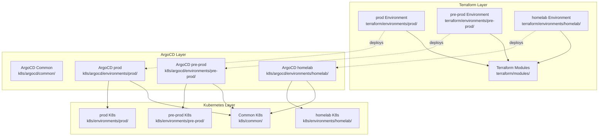
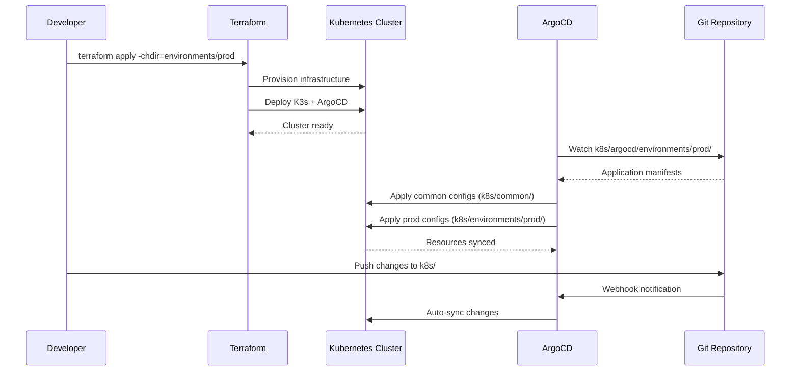

# Design Document: Multi-Environment Terraform & Kubernetes Restructure

## Overview

This design restructures the GPU MIG presentation infrastructure to support three distinct environments (prod, pre-prod, homelab) with a clear separation between common and environment-specific Kubernetes configurations. The restructure introduces Terraform modules for shared infrastructure code, environment-specific variable overrides, and ArgoCD application sets that dynamically load configurations based on the target environment.

## Architecture



## Main Workflow



## Proposed Directory Structure

### High-Level Overview

```
terraform/
├── modules/                          # Reusable Terraform modules
│   ├── scaleway-instance/           # Scaleway GPU instance module
│   ├── k3s-cluster/                 # K3s installation module
│   └── argocd-bootstrap/            # ArgoCD bootstrap module
└── environments/
    ├── prod/                        # Production environment
    ├── pre-prod/                    # Pre-production environment
    └── homelab/                     # Homelab environment

k8s/
├── common/                          # Shared K8s manifests
│   ├── 00-namespaces.yaml
│   ├── 01-gpu-operator.yaml
│   ├── 03-prometheus.yaml
│   ├── 04-grafana.yaml
│   └── ...
└── environments/
    ├── prod/                        # Production-specific configs
    │   ├── 02-mig-config.yaml
    │   ├── gpu-quotas.yaml
    │   └── ingress-prod.yaml
    ├── pre-prod/                    # Pre-prod-specific configs
    │   ├── 02-timeslicing-config.yaml
    │   └── ingress-preprod.yaml
    └── homelab/                     # Homelab-specific configs
        ├── 02-timeslicing-config.yaml
        └── local-storage.yaml

k8s/argocd/
├── common/                          # ArgoCD base install
│   ├── 00-namespace.yaml
│   ├── 01-argocd-install.yaml
│   └── 04-argocd-appproject.yaml
└── environments/
    ├── prod/
    │   └── applications.yaml        # Prod ArgoCD apps
    ├── pre-prod/
    │   └── applications.yaml        # Pre-prod ArgoCD apps
    └── homelab/
        └── applications.yaml        # Homelab ArgoCD apps
```


## Components and Interfaces

### Component 1: Terraform Modules

**Purpose**: Provide reusable infrastructure code for all environments

**Module Structure**:

```hcl
# terraform/modules/scaleway-instance/main.tf
variable "environment" {
  type        = string
  description = "Environment name (prod, pre-prod, homelab)"
}

variable "instance_type" {
  type        = string
  description = "Scaleway instance type"
}

variable "instance_name" {
  type        = string
  description = "Instance name"
}

output "instance_ip" {
  value = scaleway_instance_server.main.public_ips[0].address
}

output "instance_id" {
  value = scaleway_instance_server.main.id
}
```

**Responsibilities**:
- Define reusable infrastructure patterns
- Expose configurable variables for environment-specific overrides
- Provide consistent outputs for downstream consumption
- Encapsulate cloud provider specifics

### Component 2: Environment Configurations

**Purpose**: Define environment-specific variable values and backend configurations

**Interface**:

```hcl
# terraform/environments/prod/main.tf
module "scaleway_instance" {
  source = "../../modules/scaleway-instance"
  
  environment   = "prod"
  instance_type = "H100-1-80G"
  instance_name = "gpu-mig-prod"
  region        = var.region
  zone          = var.zone
  project_id    = var.project_id
  tags          = ["prod", "gpu", "mig-demo"]
}

module "k3s_cluster" {
  source = "../../modules/k3s-cluster"
  
  instance_ip    = module.scaleway_instance.instance_ip
  ssh_public_key = file("${path.module}/../../../ssh_key.pub")
  environment    = "prod"
}

module "argocd_bootstrap" {
  source = "../../modules/argocd-bootstrap"
  
  instance_ip = module.scaleway_instance.instance_ip
  environment = "prod"
  git_repo    = var.git_repo_url
}
```

**Responsibilities**:
- Set environment-specific variable values
- Configure S3 backend with environment-specific state keys
- Invoke modules with appropriate parameters
- Generate environment-specific outputs


### Component 3: Common Kubernetes Manifests

**Purpose**: Shared K8s resources deployed across all environments

**Interface**:

```yaml
# k8s/common/00-namespaces.yaml
apiVersion: v1
kind: Namespace
metadata:
  name: gpu-operator
  labels:
    app.kubernetes.io/managed-by: argocd
---
apiVersion: v1
kind: Namespace
metadata:
  name: monitoring
  labels:
    app.kubernetes.io/managed-by: argocd
---
apiVersion: v1
kind: Namespace
metadata:
  name: moshi-demo
  labels:
    app.kubernetes.io/managed-by: argocd
```

**Responsibilities**:
- Define base namespaces
- Configure GPU operator (common settings)
- Deploy monitoring stack (Prometheus, Grafana)
- Set up common RBAC policies
- Deploy shared services (node-exporter, kube-state-metrics)

**Common Manifests**:
- `00-namespaces.yaml` - All namespaces
- `00-nvidia-runtimeclass.yaml` - NVIDIA runtime
- `01-gpu-operator.yaml` - GPU operator base
- `03-prometheus.yaml` - Prometheus deployment
- `04-grafana.yaml` - Grafana deployment
- `04-grafana-datasources.yaml` - Grafana datasources
- `05-moshi-setup.yaml` - Moshi base setup
- `09-node-exporter.yaml` - Node exporter
- `12-kube-state-metrics.yaml` - Kube state metrics
- `14-dcgm-exporter.yaml` - DCGM exporter

### Component 4: Environment-Specific Kubernetes Manifests

**Purpose**: Environment-specific configurations and overrides

**Interface**:

```yaml
# k8s/environments/prod/02-mig-config.yaml
apiVersion: v1
kind: ConfigMap
metadata:
  name: device-plugin-config
  namespace: gpu-operator
data:
  config.yaml: |
    version: v1
    flags:
      migStrategy: mixed
    sharing:
      mig:
        strategy: mixed
```

```yaml
# k8s/environments/pre-prod/02-timeslicing-config.yaml
apiVersion: v1
kind: ConfigMap
metadata:
  name: device-plugin-config
  namespace: gpu-operator
data:
  config.yaml: |
    version: v1
    sharing:
      timeSlicing:
        replicas: 4
```

**Responsibilities**:
- GPU configuration (MIG vs Time Slicing)
- Environment-specific resource quotas
- Ingress configurations with environment-specific domains
- Environment-specific secrets
- Workload scaling parameters
- Storage configurations


**Environment-Specific Manifests by Environment**:

**prod/**:
- `02-mig-config.yaml` - MIG strategy configuration
- `06-moshi-mig.yaml` - Moshi MIG workloads
- `07-moshi-inference-mig.yaml` - Moshi inference with MIG
- `ingress-prod.yaml` - Production ingress with TLS
- `resource-quotas.yaml` - Production resource limits
- `network-policies.yaml` - Production network policies

**pre-prod/**:
- `02-timeslicing-config.yaml` - Time slicing (4 replicas)
- `06-moshi-timeslicing.yaml` - Moshi time slicing workloads
- `07-moshi-inference-timeslicing.yaml` - Moshi inference with time slicing
- `ingress-preprod.yaml` - Pre-prod ingress
- `resource-quotas.yaml` - Pre-prod resource limits

**homelab/**:
- `02-timeslicing-config.yaml` - Time slicing (2 replicas)
- `06-moshi-timeslicing.yaml` - Moshi time slicing workloads
- `local-storage.yaml` - Local storage class
- `ingress-local.yaml` - Local ingress (NodePort)
- `reduced-resources.yaml` - Lower resource requests

### Component 5: ArgoCD Environment Applications

**Purpose**: Configure ArgoCD to load appropriate manifests per environment

**Interface**:

```yaml
# k8s/argocd/environments/prod/applications.yaml
apiVersion: argoproj.io/v1alpha1
kind: Application
metadata:
  name: common-infrastructure
  namespace: argocd
spec:
  project: default
  source:
    repoURL: https://github.com/jeremie-lesage/gentle-circuit.git
    targetRevision: HEAD
    path: k8s/common
    directory:
      recurse: true
  destination:
    server: https://kubernetes.default.svc
  syncPolicy:
    automated:
      prune: true
      selfHeal: true
---
apiVersion: argoproj.io/v1alpha1
kind: Application
metadata:
  name: prod-specific
  namespace: argocd
spec:
  project: gpu-demo
  source:
    repoURL: https://github.com/jeremie-lesage/gentle-circuit.git
    targetRevision: HEAD
    path: k8s/environments/prod
    directory:
      recurse: true
  destination:
    server: https://kubernetes.default.svc
  syncPolicy:
    automated:
      prune: true
      selfHeal: true
```

**Responsibilities**:
- Define ArgoCD Application resources for common manifests
- Define ArgoCD Application resources for environment-specific manifests
- Configure sync policies per environment
- Set up project-based RBAC
- Configure automated sync and self-healing


## Data Models

### Environment Configuration Model

```hcl
# terraform/environments/{env}/terraform.tfvars
environment   = "prod"  # or "pre-prod", "homelab"
instance_type = "H100-1-80G"
instance_name = "gpu-mig-prod"
region        = "fr-par"
zone          = "fr-par-1"
project_id    = "<scaleway-project-id>"
git_repo_url  = "https://github.com/jeremie-lesage/gentle-circuit.git"

tags = [
  "prod",
  "gpu",
  "mig-demo"
]

# Environment-specific settings
enable_monitoring     = true
enable_argocd        = true
argocd_path          = "k8s/argocd/environments/prod"
k3s_version          = "v1.28.5+k3s1"
gpu_operator_version = "v23.9.0"
```

**Validation Rules**:
- `environment` must be one of: "prod", "pre-prod", "homelab"
- `instance_type` must be valid Scaleway GPU instance type
- `tags` must include environment name
- `git_repo_url` must be valid HTTPS Git URL
- `zone` must match `region` (e.g., fr-par-1 for fr-par)

### ArgoCD Application Model

```yaml
apiVersion: argoproj.io/v1alpha1
kind: Application
metadata:
  name: string                    # Application name
  namespace: argocd
  labels:
    environment: string           # prod, pre-prod, homelab
    app.kubernetes.io/part-of: argocd
spec:
  project: string                 # default, gpu-demo, monitoring
  source:
    repoURL: string               # Git repository URL
    targetRevision: string        # Branch or tag
    path: string                  # Path to manifests
    directory:
      recurse: boolean            # Recursive directory scan
      include: string             # File pattern to include
  destination:
    server: string                # Kubernetes API server
    namespace: string             # Target namespace
  syncPolicy:
    automated:
      prune: boolean              # Auto-delete resources
      selfHeal: boolean           # Auto-sync on drift
    syncOptions: []string         # Sync options
```

**Validation Rules**:
- `metadata.name` must be unique within namespace
- `spec.project` must reference existing AppProject
- `spec.source.path` must exist in repository
- `spec.destination.namespace` must exist or CreateNamespace=true
- `environment` label must match one of three environments


## Detailed File Structure

### Terraform Module: scaleway-instance

```
terraform/modules/scaleway-instance/
├── main.tf              # Instance resource definitions
├── variables.tf         # Input variables
├── outputs.tf           # Output values
└── versions.tf          # Provider version constraints
```

**main.tf**:
```hcl
resource "scaleway_instance_server" "main" {
  name  = var.instance_name
  type  = var.instance_type
  zone  = var.zone
  image = var.image_id
  tags  = concat(var.tags, [var.environment])
  
  root_volume {
    size_in_gb = var.root_volume_size
  }
  
  user_data = {
    "user-data" = templatefile("${path.module}/cloud-init.yaml.tpl", {
      ssh_public_key = var.ssh_public_key
      environment    = var.environment
    })
  }
}

resource "scaleway_instance_ip" "main" {
  zone = var.zone
  tags = concat(var.tags, [var.environment])
}
```

### Terraform Module: k3s-cluster

```
terraform/modules/k3s-cluster/
├── main.tf              # K3s installation via cloud-init
├── variables.tf         # Input variables
├── outputs.tf           # Kubeconfig output
├── templates/
│   └── k3s-install.sh.tpl
└── versions.tf
```

**main.tf**:
```hcl
resource "null_resource" "k3s_install" {
  triggers = {
    instance_ip = var.instance_ip
  }
  
  provisioner "remote-exec" {
    inline = [
      templatefile("${path.module}/templates/k3s-install.sh.tpl", {
        k3s_version = var.k3s_version
        environment = var.environment
      })
    ]
    
    connection {
      type        = "ssh"
      host        = var.instance_ip
      user        = "ubuntu"
      private_key = var.ssh_private_key
    }
  }
}
```

### Terraform Module: argocd-bootstrap

```
terraform/modules/argocd-bootstrap/
├── main.tf              # ArgoCD installation
├── variables.tf         # Input variables
├── outputs.tf           # ArgoCD URL and credentials
├── templates/
│   └── argocd-install.sh.tpl
└── versions.tf
```

**main.tf**:
```hcl
resource "null_resource" "argocd_install" {
  depends_on = [var.k3s_ready]
  
  provisioner "remote-exec" {
    inline = [
      "kubectl create namespace argocd",
      "kubectl apply -n argocd -f https://raw.githubusercontent.com/argoproj/argo-cd/stable/manifests/install.yaml",
      "kubectl apply -f ${var.git_repo_url}/k8s/argocd/common/",
      "kubectl apply -f ${var.git_repo_url}/k8s/argocd/environments/${var.environment}/"
    ]
    
    connection {
      type        = "ssh"
      host        = var.instance_ip
      user        = "ubuntu"
      private_key = var.ssh_private_key
    }
  }
}
```


### Environment Configuration: prod

```
terraform/environments/prod/
├── main.tf              # Module invocations and backend config
├── variables.tf         # Variable declarations
├── terraform.tfvars     # Variable values (gitignored)
├── outputs.tf           # Environment outputs
└── versions.tf          # Terraform and provider versions
```

**main.tf**:
```hcl
terraform {
  required_version = ">= 1.0"
  
  backend "s3" {
    endpoints = {
      s3 = "https://s3.fr-par.scw.cloud"
    }
    region = "fr-par"
    bucket = "gpu-mig-presentation-tfstate"
    key    = "prod/terraform.tfstate"
    skip_credentials_validation = true
    skip_region_validation      = true
  }
  
  required_providers {
    scaleway = {
      source  = "scaleway/scaleway"
      version = "~> 2.40"
    }
  }
}

provider "scaleway" {
  region     = var.region
  zone       = var.zone
  project_id = var.project_id
}

module "scaleway_instance" {
  source = "../../modules/scaleway-instance"
  
  environment      = "prod"
  instance_type    = var.instance_type
  instance_name    = var.instance_name
  region           = var.region
  zone             = var.zone
  tags             = var.tags
  ssh_public_key   = file("${path.module}/../../../ssh_key.pub")
  root_volume_size = 50
}

module "k3s_cluster" {
  source = "../../modules/k3s-cluster"
  
  instance_ip     = module.scaleway_instance.instance_ip
  ssh_private_key = file("${path.module}/../../../ssh_key")
  environment     = "prod"
  k3s_version     = var.k3s_version
}

module "argocd_bootstrap" {
  source = "../../modules/argocd-bootstrap"
  
  instance_ip     = module.scaleway_instance.instance_ip
  ssh_private_key = file("${path.module}/../../../ssh_key")
  environment     = "prod"
  git_repo_url    = var.git_repo_url
  k3s_ready       = module.k3s_cluster.cluster_ready
}
```

### Environment Configuration: pre-prod

```
terraform/environments/pre-prod/
├── main.tf              # Similar to prod with pre-prod backend
├── variables.tf
├── terraform.tfvars
├── outputs.tf
└── versions.tf
```

**Key Differences from prod**:
- Backend state key: `pre-prod/terraform.tfstate`
- Smaller instance type: `GPU-3070-S` (if available)
- Different tags: `["pre-prod", "gpu", "testing"]`
- Time slicing configuration by default

### Environment Configuration: homelab

```
terraform/environments/homelab/
├── main.tf              # No infrastructure provisioning
├── variables.tf
├── terraform.tfvars
└── outputs.tf
```

**Key Differences**:
- No Scaleway provider (server already exists)
- No infrastructure provisioning modules
- Only manages K3s and ArgoCD configuration on existing server
- No S3 backend (local state file)
- Connects to existing local machine via SSH (192.168.x.x or local IP)
- Uses null_resource with remote-exec for K3s/ArgoCD setup only

**main.tf**:
```hcl
terraform {
  required_version = ">= 1.0"
  
  # Local backend - no S3
  backend "local" {
    path = "terraform.tfstate"
  }
  
  required_providers {
    null = {
      source  = "hashicorp/null"
      version = "~> 3.2"
    }
  }
}

# No Scaleway provider - server already exists

# Only K3s setup on existing server
module "k3s_cluster" {
  source = "../../modules/k3s-cluster"
  
  instance_ip     = var.homelab_ip  # Existing server IP
  ssh_private_key = file("${path.module}/../../../ssh_key")
  environment     = "homelab"
  k3s_version     = var.k3s_version
}

# ArgoCD bootstrap on existing K3s
module "argocd_bootstrap" {
  source = "../../modules/argocd-bootstrap"
  
  instance_ip     = var.homelab_ip  # Existing server IP
  ssh_private_key = file("${path.module}/../../../ssh_key")
  environment     = "homelab"
  git_repo_url    = var.git_repo_url
  k3s_ready       = module.k3s_cluster.cluster_ready
}
```


## Algorithmic Pseudocode

### Main Deployment Algorithm

```pascal
ALGORITHM deployEnvironment(environment)
INPUT: environment ∈ {prod, pre-prod, homelab}
OUTPUT: deploymentResult ∈ {Success, Error}

BEGIN
  ASSERT environment ∈ {prod, pre-prod, homelab}
  
  // Step 1: Initialize Terraform
  terraformPath ← "terraform/environments/" + environment
  EXECUTE terraform init -chdir=terraformPath
  
  IF exitCode ≠ 0 THEN
    RETURN Error("Terraform initialization failed")
  END IF
  
  // Step 2: Validate Terraform configuration
  EXECUTE terraform validate -chdir=terraformPath
  
  IF exitCode ≠ 0 THEN
    RETURN Error("Terraform validation failed")
  END IF
  
  // Step 3: Plan infrastructure changes
  EXECUTE terraform plan -chdir=terraformPath -out=tfplan
  
  IF exitCode ≠ 0 THEN
    RETURN Error("Terraform plan failed")
  END IF
  
  // Step 4: Apply infrastructure
  EXECUTE terraform apply -chdir=terraformPath -auto-approve tfplan
  
  IF exitCode ≠ 0 THEN
    RETURN Error("Terraform apply failed")
  END IF
  
  // Step 5: Wait for K3s cluster readiness
  instanceIP ← terraform output -chdir=terraformPath instance_ip
  WAIT_UNTIL k3sClusterReady(instanceIP) WITH timeout=300s
  
  // Step 6: Deploy ArgoCD common resources
  EXECUTE kubectl apply -f k8s/argocd/common/
  
  // Step 7: Deploy ArgoCD environment-specific applications
  argoCDPath ← "k8s/argocd/environments/" + environment
  EXECUTE kubectl apply -f argoCDPath
  
  // Step 8: Wait for ArgoCD sync
  WAIT_UNTIL argoCDSyncComplete() WITH timeout=600s
  
  RETURN Success("Deployment complete")
END
```

**Preconditions**:
- Valid environment name provided
- Terraform installed (>= 1.0)
- kubectl installed
- SSH keys exist at ssh_key and ssh_key.pub
- Scaleway credentials configured (for prod/pre-prod)
- Git repository accessible

**Postconditions**:
- Infrastructure provisioned in target environment
- K3s cluster running and accessible
- ArgoCD installed and syncing applications
- All common manifests deployed
- Environment-specific manifests deployed

**Loop Invariants**: N/A (sequential execution)


### ArgoCD Application Sync Algorithm

```pascal
ALGORITHM syncArgoApplications(environment)
INPUT: environment ∈ {prod, pre-prod, homelab}
OUTPUT: syncResult ∈ {Success, Error}

BEGIN
  ASSERT environment ∈ {prod, pre-prod, homelab}
  
  // Step 1: Load common infrastructure application
  commonApp ← loadApplication("k8s/argocd/environments/" + environment + "/applications.yaml", "common-infrastructure")
  
  // Step 2: Sync common manifests first
  syncStatus ← argoCDSync(commonApp)
  
  IF syncStatus ≠ "Synced" THEN
    RETURN Error("Common infrastructure sync failed")
  END IF
  
  // Step 3: Load environment-specific application
  envApp ← loadApplication("k8s/argocd/environments/" + environment + "/applications.yaml", environment + "-specific")
  
  // Step 4: Sync environment-specific manifests
  syncStatus ← argoCDSync(envApp)
  
  IF syncStatus ≠ "Synced" THEN
    RETURN Error("Environment-specific sync failed")
  END IF
  
  // Step 5: Verify all resources healthy
  FOR each app IN [commonApp, envApp] DO
    health ← checkApplicationHealth(app)
    
    IF health ≠ "Healthy" THEN
      RETURN Error("Application " + app.name + " is not healthy")
    END IF
  END FOR
  
  RETURN Success("All applications synced and healthy")
END
```

**Preconditions**:
- ArgoCD installed and running
- Git repository accessible
- Application manifests exist in specified paths
- Target namespaces exist or CreateNamespace=true

**Postconditions**:
- All applications in "Synced" state
- All applications in "Healthy" state
- Resources deployed to correct namespaces
- No orphaned resources (if prune=true)

**Loop Invariants**:
- All previously checked applications remain healthy
- Sync order maintained (common before environment-specific)


### Manifest Classification Algorithm

```pascal
ALGORITHM classifyManifests(manifestFiles)
INPUT: manifestFiles: Array of YAML file paths
OUTPUT: classification: {common: Array, envSpecific: Map}

BEGIN
  common ← []
  envSpecific ← {prod: [], pre-prod: [], homelab: []}
  
  // Define classification rules
  commonPatterns ← [
    "00-namespaces.yaml",
    "00-nvidia-runtimeclass.yaml",
    "01-gpu-operator.yaml",
    "03-prometheus.yaml",
    "04-grafana*.yaml",
    "05-moshi-setup.yaml",
    "09-node-exporter.yaml",
    "12-kube-state-metrics.yaml",
    "14-dcgm-exporter.yaml"
  ]
  
  envSpecificPatterns ← {
    prod: ["02-mig-config.yaml", "*-mig.yaml", "ingress-prod.yaml"],
    pre-prod: ["02-timeslicing-config.yaml", "*-timeslicing.yaml", "ingress-preprod.yaml"],
    homelab: ["02-timeslicing-config.yaml", "*-timeslicing.yaml", "local-storage.yaml", "ingress-local.yaml"]
  }
  
  // Classify each manifest
  FOR each file IN manifestFiles DO
    fileName ← extractFileName(file)
    isCommon ← false
    
    // Check if file matches common patterns
    FOR each pattern IN commonPatterns DO
      IF matchesPattern(fileName, pattern) THEN
        common.append(file)
        isCommon ← true
        BREAK
      END IF
    END FOR
    
    // If not common, check environment-specific patterns
    IF NOT isCommon THEN
      FOR each env IN {prod, pre-prod, homelab} DO
        FOR each pattern IN envSpecificPatterns[env] DO
          IF matchesPattern(fileName, pattern) THEN
            envSpecific[env].append(file)
          END IF
        END FOR
      END FOR
    END IF
  END FOR
  
  RETURN {common: common, envSpecific: envSpecific}
END
```

**Preconditions**:
- manifestFiles is non-empty array of valid file paths
- All files are valid YAML
- File names follow numbering convention (00-15)

**Postconditions**:
- All manifests classified into common or environment-specific
- No manifest appears in multiple categories
- Common manifests applicable to all environments
- Environment-specific manifests only for target environment

**Loop Invariants**:
- All processed files are correctly classified
- No duplicate classifications exist


## Example Usage

### Deploying Production Environment

```bash
# Step 1: Set up credentials
export SCW_ACCESS_KEY="<access-key>"
export SCW_SECRET_KEY="<secret-key>"
export SCW_PROJECT_ID="<project-id>"

# Step 2: Initialize Terraform
make init ENV=prod

# Step 3: Validate configuration
make validate ENV=prod

# Step 4: Deploy infrastructure
make deploy-scaleway ENV=prod

# Step 5: Get kubeconfig
terraform -chdir=terraform/environments/prod output instance_ip
export INSTANCE_IP=$(terraform -chdir=terraform/environments/prod output -raw instance_ip)
ssh -i ssh_key ubuntu@${INSTANCE_IP} "sudo cat /etc/rancher/k3s/k3s.yaml" > ~/.kube/config
sed -i "s|127.0.0.1|${INSTANCE_IP}|g" ~/.kube/config

# Step 6: Verify ArgoCD applications
kubectl get applications -n argocd
argocd app list

# Step 7: Check deployment status
make status ENV=prod
```

### Deploying Pre-Production Environment

```bash
# Deploy pre-prod with time slicing
make init ENV=pre-prod
make validate ENV=pre-prod
make deploy-scaleway ENV=pre-prod

# Verify time slicing configuration
kubectl get configmap device-plugin-config -n gpu-operator -o yaml
```

### Deploying Homelab Environment

```bash
# Deploy to existing local GPU machine (no infrastructure provisioning)
cd terraform/environments/homelab

# Set homelab IP in terraform.tfvars
echo 'homelab_ip = "192.168.1.100"' >> terraform.tfvars

# Initialize (local backend)
terraform init

# Validate
terraform validate

# Apply (only K3s and ArgoCD setup, no server provisioning)
terraform apply

# Access via local IP
export KUBECONFIG=~/.kube/config-homelab
kubectl get nodes
```

### Switching GPU Modes in Environment

```bash
# Switch prod to time slicing (for testing)
kubectl apply -f k8s/environments/prod/02-timeslicing-config.yaml

# Switch back to MIG
kubectl apply -f k8s/environments/prod/02-mig-config.yaml

# Verify GPU configuration
kubectl describe node | grep -A 10 "Allocatable"
```

### ArgoCD Operations

```bash
# Sync all applications in prod
argocd app sync -l environment=prod

# Sync specific application
argocd app sync common-infrastructure

# View application details
argocd app get prod-specific

# Refresh application (check for changes)
argocd app refresh prod-specific

# View sync history
argocd app history prod-specific
```


## Correctness Properties

### Property 1: Environment Isolation

**Universal Quantification**:
```
∀ env₁, env₂ ∈ {prod, pre-prod, homelab} where env₁ ≠ env₂:
  state(env₁) ∩ state(env₂) = ∅ ∧
  resources(env₁) ∩ resources(env₂) = ∅
```

**Meaning**: Each environment maintains completely separate Terraform state and Kubernetes resources. No resource or state is shared between environments.

**Verification**:
- Terraform state keys are unique per environment
- Kubernetes clusters are separate instances
- No cross-environment resource dependencies

### Property 2: Manifest Classification Completeness

**Universal Quantification**:
```
∀ manifest ∈ allManifests:
  manifest ∈ commonManifests ∨ 
  manifest ∈ prodManifests ∨ 
  manifest ∈ preProdManifests ∨ 
  manifest ∈ homelabManifests
```

**Meaning**: Every Kubernetes manifest is classified into exactly one category (common or environment-specific).

**Verification**:
- Run classification algorithm on all manifests
- Ensure no manifest is unclassified
- Ensure no manifest appears in multiple categories

### Property 3: ArgoCD Sync Consistency

**Universal Quantification**:
```
∀ app ∈ argoApplications(env):
  syncStatus(app) = "Synced" ⟹
  ∀ resource ∈ app.resources:
    clusterState(resource) = gitState(resource)
```

**Meaning**: When an ArgoCD application is synced, all its resources in the cluster match the desired state in Git.

**Verification**:
- Check ArgoCD application sync status
- Compare cluster resources with Git manifests
- Verify no drift between desired and actual state

### Property 4: Module Reusability

**Universal Quantification**:
```
∀ module ∈ {scaleway-instance, k3s-cluster, argocd-bootstrap}:
  ∀ env ∈ {prod, pre-prod, homelab}:
    canInvoke(module, env) = true
```

**Meaning**: All Terraform modules can be invoked by any environment with appropriate variable overrides.

**Verification**:
- Test each module with each environment's variables
- Ensure no hard-coded environment-specific values in modules
- Verify module outputs are consistent across environments

### Property 5: Deployment Idempotency

**Universal Quantification**:
```
∀ env ∈ {prod, pre-prod, homelab}:
  deploy(env) ∘ deploy(env) = deploy(env)
```

**Meaning**: Deploying the same environment multiple times produces the same result (idempotent operation).

**Verification**:
- Run deployment twice on same environment
- Verify no changes on second run
- Check Terraform plan shows no changes
- Verify ArgoCD shows no drift


## Error Handling

### Error Scenario 1: Terraform State Lock Conflict

**Condition**: Multiple users or CI/CD pipelines attempt to modify the same environment simultaneously

**Response**: 
- Terraform acquires state lock on S3 backend
- Second operation fails with lock error message
- Error includes lock ID and timestamp

**Recovery**:
```bash
# Check lock status
terraform -chdir=terraform/environments/prod force-unlock <LOCK_ID>

# Or wait for first operation to complete
# Lock automatically releases after operation
```

### Error Scenario 2: ArgoCD Application Sync Failure

**Condition**: Git repository unreachable, invalid manifests, or resource conflicts

**Response**:
- ArgoCD marks application as "OutOfSync" or "Degraded"
- Application health status shows "Progressing" or "Degraded"
- Sync operation retries with exponential backoff

**Recovery**:
```bash
# Check application status
argocd app get <app-name>

# View sync errors
kubectl describe application <app-name> -n argocd

# Manual sync with prune
argocd app sync <app-name> --prune --force

# Rollback to previous revision
argocd app rollback <app-name> <revision-id>
```

### Error Scenario 3: K3s Cluster Not Ready

**Condition**: K3s installation fails or takes longer than expected

**Response**:
- Terraform provisioner times out after 300 seconds
- Deployment fails with timeout error
- Instance remains provisioned but K3s not running

**Recovery**:
```bash
# SSH to instance and check K3s status
ssh -i ssh_key ubuntu@<instance-ip>
sudo systemctl status k3s

# Check K3s logs
sudo journalctl -u k3s -f

# Reinstall K3s if needed
curl -sfL https://get.k3s.io | sh -

# Re-run Terraform apply
terraform -chdir=terraform/environments/<env> apply
```

### Error Scenario 4: GPU Operator Installation Failure

**Condition**: GPU operator pods fail to start or GPU not detected

**Response**:
- GPU operator pods in CrashLoopBackOff or Pending state
- ArgoCD application shows "Degraded" health
- GPU resources not available to workloads

**Recovery**:
```bash
# Check GPU operator logs
kubectl logs -n gpu-operator -l app=nvidia-device-plugin-daemonset

# Verify GPU detected
kubectl describe node | grep -A 10 "Capacity"

# Check driver installation
kubectl logs -n gpu-operator -l app=nvidia-driver-daemonset

# Reinstall GPU operator
kubectl delete -f k8s/common/01-gpu-operator.yaml
kubectl apply -f k8s/common/01-gpu-operator.yaml
```

### Error Scenario 5: Environment Variable Mismatch

**Condition**: Wrong environment specified in Makefile or Terraform command

**Response**:
- Terraform attempts to modify wrong environment
- State backend key mismatch
- Potential resource conflicts

**Recovery**:
```bash
# Always verify environment before apply
echo $ENV
terraform -chdir=terraform/environments/$ENV workspace show

# Use explicit environment in commands
make deploy-scaleway ENV=prod

# Check current state backend
terraform -chdir=terraform/environments/prod show
```


## Testing Strategy

### Unit Testing Approach

**Terraform Module Testing**:
- Use `terraform validate` to check syntax
- Use `terraform plan` with test variables to verify logic
- Test each module independently with mock variables
- Verify outputs match expected types and formats

**Test Cases**:
1. Module invocation with valid variables
2. Module invocation with missing required variables (should fail)
3. Module invocation with invalid variable types (should fail)
4. Output values are correctly exposed
5. Resource naming follows conventions

**Example Test**:
```bash
# Test scaleway-instance module
cd terraform/modules/scaleway-instance
terraform init
terraform validate

# Test with sample variables
terraform plan -var="environment=test" \
  -var="instance_type=DEV1-S" \
  -var="instance_name=test-instance" \
  -var="zone=fr-par-1" \
  -var="tags=[\"test\"]" \
  -var="ssh_public_key=ssh-rsa AAAA..."
```

**Kubernetes Manifest Testing**:
- Use `kubectl apply --dry-run=client` to validate syntax
- Use Python PyYAML to validate YAML structure
- Use `kubeval` or `kubeconform` for schema validation
- Test manifest application order

**Test Cases**:
1. All YAML files are valid YAML syntax
2. All manifests pass Kubernetes schema validation
3. Required fields are present (name, namespace, apiVersion, kind)
4. Resource limits are specified
5. Namespace references are valid

**Example Test**:
```bash
# Validate all manifests
for f in $(find k8s -name "*.yaml"); do
  echo "Validating $f"
  python3 -c "import yaml; yaml.safe_load(open('$f'))" || exit 1
  kubectl apply -f "$f" --dry-run=client -o yaml > /dev/null || exit 1
done
```

### Integration Testing Approach

**Environment Deployment Testing**:
- Deploy each environment to verify end-to-end workflow
- Verify Terraform modules integrate correctly
- Verify ArgoCD syncs all applications
- Verify GPU workloads can be scheduled

**Test Cases**:
1. Deploy prod environment from scratch
2. Deploy pre-prod environment from scratch
3. Deploy homelab environment to local machine
4. Verify all ArgoCD applications sync successfully
5. Verify GPU resources available in each environment
6. Verify monitoring stack operational
7. Verify Moshi workloads can run

**Example Test**:
```bash
# Integration test for prod environment
make init ENV=prod
make validate ENV=prod
make deploy-scaleway ENV=prod

# Wait for cluster ready
sleep 60

# Verify ArgoCD applications
kubectl get applications -n argocd
argocd app list | grep -E "(Synced|Healthy)"

# Verify GPU available
kubectl describe node | grep "nvidia.com/gpu"

# Deploy test workload
kubectl apply -f k8s/environments/prod/06-moshi-mig.yaml

# Verify workload scheduled
kubectl get pods -n moshi-demo -w
```

### Property-Based Testing Approach

**Property Test Library**: Python Hypothesis or Bash-based property tests

**Properties to Test**:
1. Environment isolation (no shared resources)
2. Manifest classification completeness
3. ArgoCD sync consistency
4. Module reusability across environments
5. Deployment idempotency

**Example Property Test**:
```python
# test_environment_isolation.py
import subprocess
import pytest
from hypothesis import given, strategies as st

@given(env1=st.sampled_from(['prod', 'pre-prod', 'homelab']),
       env2=st.sampled_from(['prod', 'pre-prod', 'homelab']))
def test_environment_state_isolation(env1, env2):
    """Verify environments have separate Terraform state"""
    if env1 == env2:
        return  # Skip same environment
    
    # Get state backend keys
    key1 = get_state_key(env1)
    key2 = get_state_key(env2)
    
    # Assert keys are different
    assert key1 != key2, f"Environments {env1} and {env2} share state key"
    
    # Assert state files are separate
    state1 = get_state_resources(env1)
    state2 = get_state_resources(env2)
    
    # No resource overlap
    assert len(set(state1) & set(state2)) == 0

def get_state_key(env):
    """Extract state key from backend config"""
    result = subprocess.run(
        ['terraform', '-chdir=terraform/environments/' + env, 'show'],
        capture_output=True, text=True
    )
    # Parse state key from output
    return f"{env}/terraform.tfstate"
```


## Performance Considerations

### Terraform State Management

**Challenge**: Large state files slow down Terraform operations

**Optimization**:
- Use separate state files per environment (already implemented)
- Enable state locking to prevent concurrent modifications
- Use S3 backend with versioning for rollback capability
- Consider state file compression for large deployments

**Expected Performance**:
- `terraform init`: 5-10 seconds
- `terraform plan`: 10-20 seconds
- `terraform apply`: 3-5 minutes (instance provisioning)
- State file size: < 100 KB per environment

### ArgoCD Sync Performance

**Challenge**: Large number of manifests slow down sync operations

**Optimization**:
- Split applications by namespace and component
- Use directory-based application sources with include patterns
- Enable automated sync with self-heal for faster convergence
- Configure appropriate sync retry limits and backoff

**Expected Performance**:
- Initial sync (all applications): 5-10 minutes
- Incremental sync (single application): 30-60 seconds
- Sync check interval: 3 minutes (default)
- Webhook-triggered sync: < 10 seconds

### K3s Cluster Provisioning

**Challenge**: K3s installation and GPU operator deployment take time

**Optimization**:
- Use cloud-init for parallel K3s installation during instance boot
- Pre-pull GPU operator images in cloud-init
- Use K3s embedded etcd for faster startup
- Configure appropriate resource limits to avoid OOM

**Expected Performance**:
- Instance provisioning: 60-90 seconds
- K3s installation: 60-120 seconds
- GPU operator ready: 3-5 minutes
- Total deployment time: 5-8 minutes

### Manifest Classification

**Challenge**: Scanning all manifests on every deployment

**Optimization**:
- Cache classification results
- Use file naming conventions for quick classification
- Implement incremental classification (only changed files)
- Use parallel processing for large manifest sets

**Expected Performance**:
- Full classification: < 1 second (50 manifests)
- Incremental classification: < 100ms
- Memory usage: < 50 MB


## Security Considerations

### Secrets Management

**Threat**: Sensitive credentials exposed in Git or Terraform state

**Mitigation**:
- Use `.gitignore` for `terraform.tfvars` and credential files
- Store Scaleway credentials in environment variables
- Use Kubernetes Secrets for application credentials
- Enable S3 backend encryption for Terraform state
- Use ArgoCD sealed secrets or external secrets operator

**Implementation**:
```bash
# .gitignore entries
terraform.tfvars
*.tfvars
credentials*.env
ssh_key
ssh_key.pub

# Environment variables for credentials
export SCW_ACCESS_KEY="<redacted>"
export SCW_SECRET_KEY="<redacted>"
export SCW_PROJECT_ID="<redacted>"

# Kubernetes secret creation
kubectl create secret generic scaleway-credentials \
  --from-literal=access-key="${SCW_ACCESS_KEY}" \
  --from-literal=secret-key="${SCW_SECRET_KEY}" \
  -n monitoring
```

### Network Security

**Threat**: Unauthorized access to cluster and services

**Mitigation**:
- Use Kubernetes NetworkPolicies to restrict pod-to-pod traffic
- Configure ingress with TLS termination
- Use Scaleway security groups to limit instance access
- Restrict SSH access to specific IP ranges
- Use private networks for inter-service communication

**Implementation**:
```yaml
# Network policy example
apiVersion: networking.k8s.io/v1
kind: NetworkPolicy
metadata:
  name: deny-all-ingress
  namespace: moshi-demo
spec:
  podSelector: {}
  policyTypes:
  - Ingress
---
apiVersion: networking.k8s.io/v1
kind: NetworkPolicy
metadata:
  name: allow-monitoring
  namespace: moshi-demo
spec:
  podSelector: {}
  ingress:
  - from:
    - namespaceSelector:
        matchLabels:
          name: monitoring
```

### RBAC and Access Control

**Threat**: Unauthorized access to Kubernetes resources

**Mitigation**:
- Use ArgoCD AppProjects for environment-based RBAC
- Configure separate service accounts per namespace
- Implement least-privilege access for workloads
- Use Kubernetes RBAC for fine-grained permissions
- Enable ArgoCD SSO with external identity provider

**Implementation**:
```yaml
# Service account with limited permissions
apiVersion: v1
kind: ServiceAccount
metadata:
  name: moshi-workload
  namespace: moshi-demo
---
apiVersion: rbac.authorization.k8s.io/v1
kind: Role
metadata:
  name: moshi-workload-role
  namespace: moshi-demo
rules:
- apiGroups: [""]
  resources: ["pods", "configmaps"]
  verbs: ["get", "list"]
---
apiVersion: rbac.authorization.k8s.io/v1
kind: RoleBinding
metadata:
  name: moshi-workload-binding
  namespace: moshi-demo
subjects:
- kind: ServiceAccount
  name: moshi-workload
roleRef:
  kind: Role
  name: moshi-workload-role
  apiGroup: rbac.authorization.k8s.io
```

### Supply Chain Security

**Threat**: Malicious or vulnerable container images

**Mitigation**:
- Use official NVIDIA GPU operator images
- Pin image versions with SHA256 digests
- Scan images for vulnerabilities (Trivy, Grype)
- Use private container registry for custom images
- Implement image pull policies (Always, IfNotPresent)

**Implementation**:
```yaml
# Pinned image with digest
spec:
  containers:
  - name: moshi
    image: nvidia/cuda:12.2.0-runtime-ubuntu22.04@sha256:abc123...
    imagePullPolicy: IfNotPresent
```

### Audit Logging

**Threat**: Lack of visibility into cluster operations

**Mitigation**:
- Enable Kubernetes audit logging
- Configure ArgoCD audit logs
- Send logs to centralized logging system
- Monitor Terraform state changes
- Track Git commits for infrastructure changes

**Implementation**:
```yaml
# K3s audit policy
apiVersion: audit.k8s.io/v1
kind: Policy
rules:
- level: Metadata
  resources:
  - group: ""
    resources: ["secrets", "configmaps"]
- level: RequestResponse
  resources:
  - group: ""
    resources: ["pods"]
  verbs: ["create", "delete"]
```


## Dependencies

### External Dependencies

**Terraform**:
- Version: >= 1.0 (tested with 1.7.0)
- Provider: Scaleway ~> 2.40
- Backend: S3-compatible (Scaleway Object Storage)

**Kubernetes**:
- K3s: v1.28.5+k3s1 or later
- kubectl: Compatible with K3s version
- Kubernetes API: v1.28+

**ArgoCD**:
- Version: v2.9+ (stable release)
- CLI: argocd (for manual operations)
- Git: For repository access

**Cloud Provider**:
- Scaleway: GPU instances (H100-1-80G, GPU-3070-S)
- Scaleway Object Storage: Terraform state backend
- Scaleway IAM: SSH key management

**GPU Software**:
- NVIDIA GPU Operator: v23.9.0+
- NVIDIA Driver: 535.x or later
- CUDA: 12.2+
- NVIDIA Container Toolkit: Latest

**Monitoring**:
- Prometheus: v2.45+
- Grafana: v10.0+
- DCGM Exporter: Latest
- Node Exporter: v1.6+
- Kube State Metrics: v2.9+

**Development Tools** (from shell.nix):
- gh: GitHub CLI
- scaleway-cli: Scaleway CLI
- k9s: Kubernetes TUI
- jq: JSON processor
- fzf: Fuzzy finder
- python3: PyYAML for validation
- act: Local GitHub Actions testing
- packer: Image building
- bun: JavaScript runtime
- uv: Python package manager

### Internal Dependencies

**Terraform Module Dependencies**:

**For prod and pre-prod (Scaleway)**:
```
scaleway-instance (no dependencies)
  ↓
k3s-cluster (depends on: scaleway-instance.instance_ip)
  ↓
argocd-bootstrap (depends on: k3s-cluster.cluster_ready)
```

**For homelab (existing server)**:
```
k3s-cluster (depends on: existing server IP from variables)
  ↓
argocd-bootstrap (depends on: k3s-cluster.cluster_ready)
```

Note: homelab does NOT use scaleway-instance module since the server already exists.

**Kubernetes Manifest Dependencies**:
```
00-namespaces.yaml (no dependencies)
  ↓
01-gpu-operator.yaml (depends on: namespaces)
  ↓
02-*-config.yaml (depends on: gpu-operator)
  ↓
03-prometheus.yaml, 04-grafana.yaml (depends on: namespaces)
  ↓
05-moshi-setup.yaml (depends on: namespaces, gpu-operator)
  ↓
06-moshi-*.yaml, 07-moshi-*.yaml (depends on: moshi-setup, gpu-config)
```

**ArgoCD Application Dependencies**:
```
common-infrastructure (no dependencies)
  ↓
environment-specific (depends on: common-infrastructure synced)
```

### Version Compatibility Matrix

| Component | prod | pre-prod | homelab |
|-----------|------|----------|---------|
| Terraform | 1.7.0 | 1.7.0 | 1.7.0 |
| K3s | v1.28.5+k3s1 | v1.28.5+k3s1 | v1.28.5+k3s1 |
| GPU Operator | v23.9.0 | v23.9.0 | v23.9.0 |
| ArgoCD | v2.9.3 | v2.9.3 | v2.9.3 |
| Prometheus | v2.45.0 | v2.45.0 | v2.45.0 |
| Grafana | v10.0.3 | v10.0.3 | v10.0.3 |
| Instance Type | H100-1-80G | GPU-3070-S | Local GPU |
| GPU Mode | MIG | Time Slicing | Time Slicing |


## Migration Strategy

### Phase 1: Backup Current State

**Objective**: Preserve existing infrastructure and configurations

**Steps**:
1. Export current Terraform state files
2. Backup existing Kubernetes manifests
3. Document current environment configurations
4. Export ArgoCD application definitions

**Commands**:
```bash
# Backup Terraform state
mkdir -p backups/terraform
terraform -chdir=terraform/environments/dev state pull > backups/terraform/dev-state.json
terraform -chdir=terraform/environments/prod state pull > backups/terraform/prod-state.json

# Backup K8s manifests
mkdir -p backups/k8s
cp -r k8s/ backups/k8s/

# Backup ArgoCD applications
mkdir -p backups/argocd
kubectl get applications -n argocd -o yaml > backups/argocd/applications.yaml
kubectl get appprojects -n argocd -o yaml > backups/argocd/appprojects.yaml
```

### Phase 2: Create New Directory Structure

**Objective**: Set up new directory structure without disrupting existing deployments

**Steps**:
1. Create Terraform modules directory structure
2. Create new environment directories (prod, pre-prod, homelab)
3. Create K8s common and environment-specific directories
4. Create ArgoCD environment directories

**Commands**:
```bash
# Create Terraform structure
mkdir -p terraform/modules/{scaleway-instance,k3s-cluster,argocd-bootstrap}
mkdir -p terraform/environments/{prod,pre-prod,homelab}

# Create K8s structure
mkdir -p k8s/common
mkdir -p k8s/environments/{prod,pre-prod,homelab}

# Create ArgoCD structure
mkdir -p k8s/argocd/common
mkdir -p k8s/argocd/environments/{prod,pre-prod,homelab}
```

### Phase 3: Migrate Terraform Modules

**Objective**: Extract reusable code into modules

**Steps**:
1. Create scaleway-instance module from existing instances.tf
2. Create k3s-cluster module from cloud-init templates
3. Create argocd-bootstrap module
4. Update environment configurations to use modules

**Process**:
```bash
# Extract instance code to module
cp terraform/environments/dev/instances.tf terraform/modules/scaleway-instance/main.tf
# Edit to parameterize environment-specific values

# Test module
cd terraform/modules/scaleway-instance
terraform init
terraform validate
```

### Phase 4: Classify and Move Kubernetes Manifests

**Objective**: Separate common and environment-specific manifests

**Steps**:
1. Run classification algorithm on existing manifests
2. Move common manifests to k8s/common/
3. Move environment-specific manifests to k8s/environments/{env}/
4. Update manifest references in ArgoCD applications

**Classification Script**:
```bash
#!/bin/bash
# classify-manifests.sh

COMMON_PATTERNS=(
  "00-namespaces.yaml"
  "00-nvidia-runtimeclass.yaml"
  "01-gpu-operator.yaml"
  "03-prometheus.yaml"
  "04-grafana*.yaml"
  "05-moshi-setup.yaml"
  "09-node-exporter.yaml"
  "12-kube-state-metrics.yaml"
  "14-dcgm-exporter.yaml"
)

# Move common manifests
for pattern in "${COMMON_PATTERNS[@]}"; do
  for file in k8s/$pattern; do
    if [ -f "$file" ]; then
      echo "Moving $file to k8s/common/"
      cp "$file" k8s/common/
    fi
  done
done

# Move prod-specific (MIG configs)
cp k8s/02-mig-config.yaml k8s/environments/prod/
cp k8s/07-moshi-mig.yaml k8s/environments/prod/
cp k8s/10-moshi-inference-mig.yaml k8s/environments/prod/

# Move pre-prod-specific (Time Slicing configs)
cp k8s/02-timeslicing-config.yaml k8s/environments/pre-prod/
cp k8s/06-moshi-timeslicing.yaml k8s/environments/pre-prod/
cp k8s/09-moshi-inference-timeslicing.yaml k8s/environments/pre-prod/

# Copy time slicing to homelab
cp k8s/02-timeslicing-config.yaml k8s/environments/homelab/
cp k8s/06-moshi-timeslicing.yaml k8s/environments/homelab/
```

### Phase 5: Update ArgoCD Applications

**Objective**: Configure ArgoCD to use new directory structure

**Steps**:
1. Create new ArgoCD application manifests for each environment
2. Update source paths to point to new directories
3. Test application sync in non-production environment first
4. Gradually migrate production applications

**Migration Order**:
1. homelab (lowest risk)
2. pre-prod (medium risk)
3. prod (highest risk, migrate last)

### Phase 6: Update Makefile and Scripts

**Objective**: Update automation to work with new structure

**Steps**:
1. Update Makefile targets to use new environment paths
2. Update deploy scripts to reference new directories
3. Update CI/CD workflows
4. Test all Makefile targets

**Updated Makefile**:
```makefile
init:
	@terraform -chdir=terraform/environments/$(ENV) init

validate:
	@terraform -chdir=terraform/environments/$(ENV) validate

deploy-scaleway:
	@terraform -chdir=terraform/environments/$(ENV) apply -auto-approve
```

### Phase 7: Validation and Testing

**Objective**: Verify migration success

**Steps**:
1. Deploy homelab environment from scratch
2. Deploy pre-prod environment from scratch
3. Verify all ArgoCD applications sync
4. Run integration tests
5. Deploy prod environment (or migrate existing)

**Validation Checklist**:
- [ ] Terraform modules validate successfully
- [ ] All environments can be deployed independently
- [ ] ArgoCD applications sync without errors
- [ ] GPU workloads schedule correctly
- [ ] Monitoring stack operational
- [ ] No resource conflicts between environments
- [ ] Makefile targets work as expected
- [ ] CI/CD pipelines pass

### Phase 8: Cleanup

**Objective**: Remove old structure after successful migration

**Steps**:
1. Archive old manifests and configurations
2. Remove old environment directories (dev, local, gpu-worker)
3. Update documentation
4. Remove backup files after verification period

**Cleanup Commands**:
```bash
# Archive old structure
tar -czf backups/old-structure-$(date +%Y%m%d).tar.gz \
  terraform/environments/dev \
  terraform/environments/local \
  terraform/environments/gpu-worker \
  k8s/*.yaml

# Remove old directories (after verification)
rm -rf terraform/environments/dev
rm -rf terraform/environments/local
rm -rf terraform/environments/gpu-worker

# Keep only new structure
ls terraform/environments/
# Should show: prod pre-prod homelab
```

### Rollback Plan

**If migration fails**:
1. Restore Terraform state from backups
2. Restore K8s manifests from backups
3. Reapply ArgoCD applications from backups
4. Document issues encountered
5. Plan remediation before retry

**Rollback Commands**:
```bash
# Restore Terraform state
terraform -chdir=terraform/environments/dev state push backups/terraform/dev-state.json

# Restore K8s manifests
kubectl apply -f backups/k8s/

# Restore ArgoCD applications
kubectl apply -f backups/argocd/applications.yaml
```


## Implementation Checklist

### Terraform Restructure

- [ ] Create `terraform/modules/scaleway-instance/` with main.tf, variables.tf, outputs.tf
- [ ] Create `terraform/modules/k3s-cluster/` with installation logic
- [ ] Create `terraform/modules/argocd-bootstrap/` with ArgoCD setup
- [ ] Create `terraform/environments/prod/` with module invocations
- [ ] Create `terraform/environments/pre-prod/` with module invocations
- [ ] Create `terraform/environments/homelab/` with configuration for existing server (no infrastructure provisioning)
- [ ] Update backend configuration for each environment (unique state keys)
- [ ] Create terraform.tfvars templates for each environment
- [ ] Test module validation: `terraform validate` in each module
- [ ] Test environment deployment: `terraform plan` in each environment

### Kubernetes Manifest Restructure

- [ ] Create `k8s/common/` directory
- [ ] Move common manifests to `k8s/common/`:
  - [ ] 00-namespaces.yaml
  - [ ] 00-nvidia-runtimeclass.yaml
  - [ ] 01-gpu-operator.yaml
  - [ ] 03-prometheus.yaml
  - [ ] 04-grafana.yaml
  - [ ] 04-grafana-datasources.yaml
  - [ ] 05-moshi-setup.yaml
  - [ ] 09-node-exporter.yaml
  - [ ] 12-kube-state-metrics.yaml
  - [ ] 14-dcgm-exporter.yaml
- [ ] Create `k8s/environments/prod/` directory
- [ ] Move prod-specific manifests:
  - [ ] 02-mig-config.yaml
  - [ ] 07-moshi-mig.yaml
  - [ ] 10-moshi-inference-mig.yaml
  - [ ] Create ingress-prod.yaml
  - [ ] Create resource-quotas.yaml
- [ ] Create `k8s/environments/pre-prod/` directory
- [ ] Move pre-prod-specific manifests:
  - [ ] 02-timeslicing-config.yaml
  - [ ] 06-moshi-timeslicing.yaml
  - [ ] 09-moshi-inference-timeslicing.yaml
  - [ ] Create ingress-preprod.yaml
- [ ] Create `k8s/environments/homelab/` directory
- [ ] Create homelab-specific manifests:
  - [ ] 02-timeslicing-config.yaml (2 replicas)
  - [ ] 06-moshi-timeslicing.yaml
  - [ ] Create local-storage.yaml
  - [ ] Create ingress-local.yaml
- [ ] Validate all YAML files: `python3 -c "import yaml; yaml.safe_load(open('file'))"`

### ArgoCD Restructure

- [ ] Create `k8s/argocd/common/` directory
- [ ] Move ArgoCD base install to common:
  - [ ] 00-namespace.yaml
  - [ ] 01-argocd-install.yaml
  - [ ] 04-argocd-appproject.yaml
- [ ] Create `k8s/argocd/environments/prod/` directory
- [ ] Create prod ArgoCD applications.yaml:
  - [ ] Application for common-infrastructure
  - [ ] Application for prod-specific
- [ ] Create `k8s/argocd/environments/pre-prod/` directory
- [ ] Create pre-prod ArgoCD applications.yaml:
  - [ ] Application for common-infrastructure
  - [ ] Application for pre-prod-specific
- [ ] Create `k8s/argocd/environments/homelab/` directory
- [ ] Create homelab ArgoCD applications.yaml:
  - [ ] Application for common-infrastructure
  - [ ] Application for homelab-specific
- [ ] Update AppProjects with environment labels
- [ ] Test ArgoCD application validation: `kubectl apply --dry-run=client`

### Makefile Updates

- [ ] Update `init` target to support ENV variable
- [ ] Update `validate` target for new environment paths
- [ ] Update `deploy-scaleway` target for prod and pre-prod
- [ ] Update `deploy-local` target for homelab
- [ ] Update `destroy` target for all environments
- [ ] Update `clean` target for new directory structure
- [ ] Add `deploy-prod` convenience target
- [ ] Add `deploy-preprod` convenience target
- [ ] Add `deploy-homelab` convenience target
- [ ] Test all Makefile targets

### Documentation Updates

- [ ] Update README.md with new structure
- [ ] Update AGENTS.md with new environment paths
- [ ] Create MIGRATION.md with migration guide
- [ ] Update docs/QUICKSTART.md
- [ ] Update docs/PLAN.md
- [ ] Create docs/ARCHITECTURE.md with new design
- [ ] Update inline comments in Terraform files
- [ ] Update inline comments in Kubernetes manifests

### CI/CD Updates

- [ ] Update `.github/workflows/validate.yml` for new paths
- [ ] Update `.github/workflows/deploy.yml` for environment selection
- [ ] Update `.github/workflows/destroy.yml` for environment selection
- [ ] Add workflow for pre-prod deployment
- [ ] Test CI/CD workflows with act: `act -j validate`

### Testing and Validation

- [ ] Run Terraform validate on all modules
- [ ] Run Terraform plan on all environments
- [ ] Deploy homelab environment (test)
- [ ] Deploy pre-prod environment (test)
- [ ] Verify ArgoCD sync in homelab
- [ ] Verify ArgoCD sync in pre-prod
- [ ] Run GPU workload test in homelab
- [ ] Run GPU workload test in pre-prod
- [ ] Deploy prod environment (or migrate existing)
- [ ] Verify all monitoring dashboards
- [ ] Run integration tests
- [ ] Verify environment isolation (separate states)

### Cleanup

- [ ] Archive old directory structure
- [ ] Remove old environment directories (after verification)
- [ ] Remove backup files (after 30-day retention)
- [ ] Update .gitignore if needed
- [ ] Clean up unused manifests


## Correctness Properties

*A property is a characteristic or behavior that should hold true across all valid executions of a system—essentially, a formal statement about what the system should do. Properties serve as the bridge between human-readable specifications and machine-verifiable correctness guarantees.*

### Property 1: Module Interface Contract

*For any* Terraform module in the system, the module SHALL define all input variables with explicit type and description, and SHALL expose outputs that downstream consumers can reference.

**Validates: Requirements 1.4, 1.5, 1.6**

### Property 2: Environment State Isolation

*For any* two distinct environments (env₁, env₂) where env₁ ≠ env₂, the Terraform state backend keys SHALL be unique, ensuring no shared state between environments.

**Validates: Requirements 5.1, 5.5**

### Property 3: Environment Resource Isolation

*For any* environment configuration, all cloud resources SHALL include environment-specific tags, and resource names SHALL incorporate environment identifiers to prevent cross-environment conflicts.

**Validates: Requirements 5.3, 5.4**

### Property 4: Manifest Classification Completeness

*For any* Kubernetes manifest file in the system, the manifest SHALL be classified into exactly one category (common or environment-specific for a particular environment), with no manifest appearing in multiple categories.

**Validates: Requirements 8.1, 8.2, 8.3, 8.4, 8.5**

### Property 5: Module Parameterization

*For any* Terraform module, the module code SHALL NOT contain hard-coded environment-specific values, and all environment-specific settings SHALL be exposed as module variables.

**Validates: Requirements 6.2, 6.3**

### Property 6: ArgoCD Application Structure

*For any* environment, the ArgoCD applications SHALL include one application referencing k8s/common/ and one application referencing k8s/environments/{env}/, both configured with automated sync and self-heal policies.

**Validates: Requirements 4.3, 4.4, 4.5**

### Property 7: Deployment Idempotency

*For any* environment, executing terraform plan twice consecutively without intervening changes SHALL report zero planned changes on the second execution.

**Validates: Requirements 7.1**

### Property 8: Manifest Application Order

*For any* environment deployment via ArgoCD, common manifests SHALL be applied before environment-specific manifests, ensuring dependencies are satisfied.

**Validates: Requirements 3.7**

### Property 9: Configuration Validity

*For all* Terraform modules, running terraform validate SHALL succeed, and *for all* Kubernetes manifests, running kubectl apply --dry-run=client SHALL succeed, and *for all* YAML files, parsing with PyYAML SHALL succeed without errors.

**Validates: Requirements 18.1, 18.2, 18.3**

### Property 10: Credential Exclusion

*For all* files tracked in Git, no file SHALL contain Scaleway credentials (access keys, secret keys, or project IDs), ensuring credentials are only provided via environment variables or gitignored files.

**Validates: Requirements 15.1**

### Property 11: Homelab Infrastructure Exclusion

*For the* homelab environment configuration, the Terraform code SHALL NOT invoke the scaleway-instance module, and SHALL only configure K3s and ArgoCD on an existing server specified by IP address variable.

**Validates: Requirements 2.5, 2.6**

### Property 12: Backend Configuration Consistency

*For any* environment in {prod, pre-prod}, the Terraform backend configuration SHALL use S3-compatible storage with state key format "{env}/terraform.tfstate", and *for* homelab environment, the backend SHALL use local storage.

**Validates: Requirements 2.7, 2.8**

### Property 13: Module Reusability

*For any* Terraform module and *for any* environment that invokes that module, the module SHALL execute successfully with terraform validate when provided with valid environment-specific variables.

**Validates: Requirements 6.1, 6.4**

## Summary

This design document outlines a comprehensive restructure of the GPU MIG presentation infrastructure to support three distinct environments: prod, pre-prod, and homelab. The restructure introduces:

1. **Terraform Modules**: Reusable infrastructure code (scaleway-instance, k3s-cluster, argocd-bootstrap) that eliminates duplication and ensures consistency across environments.

2. **Environment Separation**: Clear separation of environment-specific configurations with unique Terraform state backends, allowing independent management and deployment of each environment.

3. **Kubernetes Manifest Organization**: Common manifests shared across all environments (namespaces, GPU operator, monitoring) separated from environment-specific configurations (GPU modes, ingress, resource quotas).

4. **ArgoCD Environment-Aware Applications**: ArgoCD applications configured per environment to automatically load the correct combination of common and environment-specific manifests, enabling GitOps-based deployment and management.

5. **Migration Strategy**: Phased migration approach with backup, validation, and rollback procedures to ensure safe transition from the current structure to the new multi-environment architecture.

The design maintains compatibility with existing tools (Makefile, CI/CD workflows, shell.nix) while providing a scalable foundation for managing multiple environments with different configurations and requirements.

**Key Benefits**:
- Environment isolation prevents cross-environment conflicts
- Reusable modules reduce code duplication
- ArgoCD automation enables GitOps workflows
- Clear separation of concerns improves maintainability
- Scalable architecture supports future environment additions

**Next Steps**: Proceed to requirements derivation phase to define specific acceptance criteria and implementation tasks based on this design.
