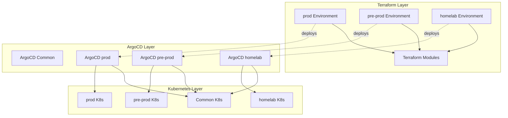

# GPU MIG Presentation Infrastructure

> **Multi-environment Terraform + Kubernetes infrastructure for demonstrating NVIDIA GPU MIG vs Time Slicing on Scaleway cloud**

[](./LICENSE)
[](https://www.terraform.io/)
[](https://k3s.io/)
[](https://www.nvidia.com/en-us/data-center/l4/)

## Overview

This infrastructure demonstrates NVIDIA GPU Multi-Instance GPU (MIG) and Time Slicing capabilities using Terraform, Kubernetes (K3s), and ArgoCD. It supports three distinct environments (prod, pre-prod, homelab) with clear separation between common and environment-specific configurations.

**Key Features:**
- 🏗️ **Modular Terraform** - Reusable modules for Scaleway instances, K3s clusters, and ArgoCD
- 🌍 **Multi-Environment** - Separate configurations for prod, pre-prod, and homelab
- 🔄 **GitOps Ready** - ArgoCD for automated Kubernetes deployments
- 📊 **Full Monitoring** - Prometheus, Grafana, DCGM Exporter for GPU metrics
- 🎯 **GPU Flexibility** - Switch between MIG and Time Slicing modes

## 🚀 Quick Start

### Prerequisites
- Terraform >= 1.0
- kubectl
- Scaleway account (for prod/pre-prod)
- SSH key pair

### Deploy Production Environment

```bash
# 1. Set up credentials
export SCW_ACCESS_KEY="<your-access-key>"
export SCW_SECRET_KEY="<your-secret-key>"
export SCW_PROJECT_ID="<your-project-id>"

# 2. Initialize and deploy
make init ENV=prod
make validate ENV=prod
make deploy-scaleway ENV=prod

# 3. Get kubeconfig
export INSTANCE_IP=$(terraform -chdir=terraform/environments/prod output -raw instance_ip)
ssh -i ssh_key ubuntu@${INSTANCE_IP} "sudo cat /etc/rancher/k3s/k3s.yaml" > ~/.kube/config
sed -i "s|127.0.0.1|${INSTANCE_IP}|g" ~/.kube/config

# 4. Verify deployment
kubectl get pods -A
```

### Deploy Homelab Environment

```bash
# 1. Configure homelab IP
cd terraform/environments/homelab
echo 'homelab_ip = "192.168.1.100"' >> terraform.tfvars

# 2. Deploy (no infrastructure provisioning, only K3s + ArgoCD setup)
terraform init
terraform apply

# 3. Access cluster
export KUBECONFIG=~/.kube/config-homelab
kubectl get nodes
```

📖 **[Full Deployment Guide →](./docs/QUICKSTART.md)**

---

## 🏗️ Architecture

### Directory Structure

```
terraform/
├── modules/                          # Reusable Terraform modules
│   ├── scaleway-instance/           # Scaleway GPU instance provisioning
│   ├── k3s-cluster/                 # K3s installation
│   └── argocd-bootstrap/            # ArgoCD deployment
└── environments/
    ├── prod/                        # Production (MIG mode)
    ├── pre-prod/                    # Pre-production (Time Slicing, 4 replicas)
    └── homelab/                     # Homelab (Time Slicing, 2 replicas)

k8s/
├── common/                          # Shared manifests (all environments)
│   ├── 00-namespaces.yaml
│   ├── 01-gpu-operator.yaml
│   ├── 03-prometheus.yaml
│   └── 04-grafana.yaml
└── environments/
    ├── prod/                        # Production-specific configs
    │   ├── 02-mig-config.yaml
    │   └── ingress-prod.yaml
    ├── pre-prod/                    # Pre-prod-specific configs
    │   ├── 02-timeslicing-config.yaml
    │   └── ingress-preprod.yaml
    └── homelab/                     # Homelab-specific configs
        ├── 02-timeslicing-config.yaml
        └── ingress-local.yaml

k8s/argocd/
├── common/                          # ArgoCD base installation
└── environments/
    ├── prod/applications.yaml       # Prod ArgoCD apps
    ├── pre-prod/applications.yaml   # Pre-prod ArgoCD apps
    └── homelab/applications.yaml    # Homelab ArgoCD apps
```

### Component Flow



---

## 🌍 Environments

| Environment | Terraform Path | State Backend | GPU Mode | Replicas | Usage |
|------------|----------------|---------------|----------|----------|-------|
| **prod** | `terraform/environments/prod/` | S3 (`prod/terraform.tfstate`) | MIG | N/A | Production deployments |
| **pre-prod** | `terraform/environments/pre-prod/` | S3 (`pre-prod/terraform.tfstate`) | Time Slicing | 4 | Testing and staging |
| **homelab** | `terraform/environments/homelab/` | Local | Time Slicing | 2 | Local GPU server (no provisioning) |

### Environment Comparison

| Feature | prod | pre-prod | homelab |
|---------|------|----------|---------|
| Infrastructure Provisioning | ✅ Scaleway | ✅ Scaleway | ❌ Existing server |
| GPU Strategy | MIG | Time Slicing | Time Slicing |
| State Backend | S3 | S3 | Local |
| TLS/Ingress | ✅ Production domain | ✅ Pre-prod domain | ❌ .montech.mylab suffix |
| Resource Limits | High | Medium | Low |
| Network Policies | ✅ Enabled | ❌ Disabled | ❌ Disabled |

---
## 🛠️ Makefile Targets

| Target | Description | Example |
|--------|-------------|---------|
| `make init` | Initialize Terraform for environment | `make init ENV=prod` |
| `make validate` | Validate Terraform configuration | `make validate ENV=pre-prod` |
| `make deploy-scaleway` | Deploy to Scaleway (prod/pre-prod) | `make deploy-scaleway ENV=prod` |
| `make deploy-homelab` | Deploy to homelab (existing server) | `make deploy-homelab` |
| `make destroy` | Destroy environment | `make destroy ENV=prod` |
| `make status` | Check pod status | `make status ENV=prod` |
| `make switch-timeslicing` | Switch GPU to Time Slicing mode | `make switch-timeslicing ENV=prod` |
| `make switch-mig` | Switch GPU to MIG mode | `make switch-mig ENV=prod` |
| `make clean` | Clean local state files | `make clean` |

---

## 🎮 GPU Modes

### MIG (Multi-Instance GPU)

Partitions a single GPU into multiple isolated instances with dedicated memory and compute resources.

**Use Cases:**
- Multi-tenant environments
- Guaranteed QoS per workload
- Strict resource isolation

**Configuration (prod):**
```yaml
# k8s/environments/prod/02-mig-config.yaml
sharing:
  mig:
    strategy: mixed
```

### Time Slicing

Allows multiple workloads to share a single GPU through time-multiplexing.

**Use Cases:**
- Development/testing environments
- Batch processing
- Cost optimization

**Configuration (pre-prod):**
```yaml
# k8s/environments/pre-prod/02-timeslicing-config.yaml
sharing:
  timeSlicing:
    replicas: 4
```

**Configuration (homelab):**
```yaml
# k8s/environments/homelab/02-timeslicing-config.yaml
sharing:
  timeSlicing:
    replicas: 2
```

---

## 📊 Monitoring Stack

All environments include a complete monitoring stack:

| Component | Port | Credentials | Purpose |
|-----------|------|-------------|---------|
| **Grafana** | 30300 | admin/admin | Visualization dashboards |
| **Prometheus** | 30090 | N/A | Metrics collection |
| **DCGM Exporter** | 9400 | N/A | GPU metrics |
| **Node Exporter** | 9100 | N/A | Node metrics |
| **Kube State Metrics** | 8080 | N/A | Kubernetes object metrics |

**Access Grafana:**
```bash
# Get instance IP
export INSTANCE_IP=$(terraform -chdir=terraform/environments/prod output -raw instance_ip)

# Open in browser
open http://${INSTANCE_IP}:30300
```

---

## 🔄 GitOps with ArgoCD

ArgoCD automatically syncs Kubernetes manifests from Git to your cluster.

### ArgoCD Applications

Each environment has two ArgoCD applications:

1. **common-infrastructure** - Deploys manifests from `k8s/common/`
2. **{env}-specific** - Deploys manifests from `k8s/environments/{env}/`

### Access ArgoCD UI

```bash
# Port-forward ArgoCD server
kubectl port-forward svc/argocd-server -n argocd 8080:443

# Get initial admin password
kubectl -n argocd get secret argocd-initial-admin-secret \
  -o jsonpath='{.data.password}' | base64 -d

# Open in browser
open https://localhost:8080
```

### Sync Applications

```bash
# Sync all applications in environment
argocd app sync -l environment=prod

# Sync specific application
argocd app sync common-infrastructure

# View application status
argocd app get prod-specific
```

---

## 🔐 Security

### Secrets Management

- ✅ Terraform state encrypted at rest (S3 backend)
- ✅ SSH keys excluded from Git (`.gitignore`)
- ✅ Scaleway credentials via environment variables
- ✅ Network policies in production environment
- ✅ RBAC for ArgoCD applications

### Excluded from Git

```
terraform.tfvars
credentials*.env
ssh_key*
*.tfstate
*.tfstate.backup
```

### Required Environment Variables

```bash
export SCW_ACCESS_KEY="<your-access-key>"
export SCW_SECRET_KEY="<your-secret-key>"
export SCW_PROJECT_ID="<your-project-id>"
```

---

## 🔧 Migration & Maintenance

### Backup Current State

```bash
./scripts/backup-current-state.sh
```

Creates timestamped backup of:
- Terraform state files
- Kubernetes manifests
- ArgoCD applications

### Classify Manifests

```bash
./scripts/classify-manifests.sh
```

Automatically categorizes manifests as common or environment-specific.

### Rollback Migration

```bash
./scripts/rollback-migration.sh backups/20240313_120000
```

Restores Terraform state and Kubernetes manifests from backup.

---

## 📚 Documentation

| Document | Description |
|----------|-------------|
| **[AGENTS.md](./AGENTS.md)** | AI agent guidelines and project structure |
| **[MIGRATION.md](./MIGRATION.md)** | Step-by-step migration guide |
| **[ARCHITECTURE.md](./ARCHITECTURE.md)** | Architecture diagrams and design |
| **[QUICKSTART.md](./docs/QUICKSTART.md)** | Quick start deployment guide |

---

## 💰 Cost Estimation

| Environment | Instance Type | GPU | Cost (Scaleway) |
|------------|---------------|-----|-----------------|
| **prod** | H100-1-80G | NVIDIA L4-24GB | ~€0.85/hour |
| **pre-prod** | GPU-3070-S | NVIDIA RTX 3070 | ~€0.40/hour |
| **homelab** | N/A | Your GPU | €0 (no cloud costs) |

---

## 🐛 Troubleshooting

### Terraform State Lock

```bash
# Force unlock if needed
terraform -chdir=terraform/environments/prod force-unlock <LOCK_ID>
```

### Pod Not Starting

```bash
# Check pod status
kubectl describe pod <pod-name> -n <namespace>

# View logs
kubectl logs <pod-name> -n <namespace>
```

### GPU Not Available

```bash
# Check GPU nodes
kubectl get nodes -o jsonpath='{.items[*].status.allocatable.nvidia\.com/gpu}'

# Check GPU operator pods
kubectl get pods -n gpu-operator
```

### ArgoCD Sync Failed

```bash
# View application details
argocd app get <app-name>

# Manual sync
argocd app sync <app-name> --force
```

---

## 🤝 Contributing

Contributions welcome! Please:

1. Fork the repository
2. Create a feature branch
3. Make your changes
4. Submit a pull request

---

## 📄 License

This project is licensed under the MIT License - see the [LICENSE](./LICENSE) file for details.

---

## 🏷️ Keywords

`terraform` `kubernetes` `k3s` `gpu` `nvidia` `mig` `time-slicing` `scaleway` `argocd` `gitops` `prometheus` `grafana` `infrastructure-as-code` `multi-environment` `devops` `cloud-infrastructure`

---

<div align="center">

**Built for demonstrating NVIDIA GPU sharing strategies**

💡 **Questions?** Open an issue or check the [documentation](./docs/)

</div>
