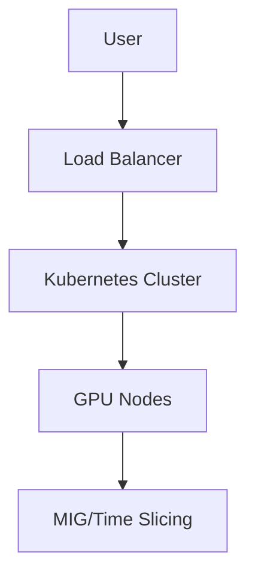

# Documentation Agent - Quick Start Guide

## Overview
This guide helps you get started with the Documentation Agent for the GPU MIG vs Time Slicing project.

## Setup

### 1. Load the Skill
```bash
skill name="documentation-agent"
```

### 2. Verify Available Tools
The agent has access to these tools:
- `read`: Read files from the codebase
- `glob`: Find files by patterns  
- `grep`: Search file contents
- `write`: Write documentation files (docs/ and tasks/ only)
- `edit`: Edit documentation files (docs/ and tasks/ only)

## Basic Usage

### Exploring the Codebase
```bash
# List all Terraform files
glob pattern="**/*.tf"

# Read a specific file
read filePath="/home/jeremie/Documents/perso/note/blog/mig-time-slincing/assets/gpu-mig-presentation/terraform/environments/dev/main.tf"

# Search for GPU-related configurations
grep pattern="gpu|GPU|nvidia" include="*.tf"
```

### Creating Documentation
```bash
# Create a new documentation file
write filePath="/home/jeremie/Documents/perso/note/blog/mig-time-slincing/assets/gpu-mig-presentation/docs/architecture/gpu-setup.md" content="# GPU Setup Documentation..."

# Edit an existing documentation file
edit filePath="/home/jeremie/Documents/perso/note/blog/mig-time-slincing/assets/gpu-mig-presentation/docs/terraform/overview.md" oldString="Old content" newString="Updated content"
```

### Managing Tasks
```bash
# Create a new task file
write filePath="/home/jeremie/Documents/perso/note/blog/mig-time-slincing/assets/gpu-mig-presentation/tasks/documentation/terraform-docs.md" content="# Task: Document Terraform Setup..."

# Update task status
edit filePath="/home/jeremie/Documents/perso/note/blog/mig-time-slincing/assets/gpu-mig-presentation/tasks/documentation/terraform-docs.md" oldString="- [ ] Not Started" newString="- [x] Completed"
```

## Documentation Structure

### Recommended Folder Structure
```
docs/
├── architecture/          # System architecture and diagrams
├── terraform/            # Terraform infrastructure docs
├── kubernetes/           # Kubernetes setup and configs
├── monitoring/           # Monitoring and observability
├── environments/          # Environment-specific guides
│   ├── dev/              # Development environment
│   └── prod/             # Production environment
├── guides/               # User guides and tutorials
└── references/            # External references and sources

tasks/
├── documentation/        # Documentation tasks
├── exploration/          # Code exploration tasks
└── quality-assurance/    # Documentation QA tasks
```

## Best Practices

### Documentation Writing
1. **Be Clear and Concise**: Use simple, direct language
2. **Include Examples**: Show practical usage examples
3. **Reference Code**: Link to relevant source files
4. **Use Visuals**: Add diagrams where helpful
5. **Stay Updated**: Keep docs in sync with code

### Task Management
1. **Break Down Tasks**: Split large tasks into smaller ones
2. **Prioritize**: Mark tasks as High/Medium/Low priority
3. **Track Progress**: Update task status regularly
4. **Be Specific**: Include clear requirements and dependencies
5. **Review**: Check completed tasks for quality

### Code Exploration
1. **Be Thorough**: Understand the full context
2. **Take Notes**: Document your findings
3. **Verify**: Cross-check with multiple sources
4. **Ask Questions**: When something is unclear
5. **Document**: Record important discoveries

## Example Workflow

### Creating Terraform Documentation

1. **Explore Terraform files**:
```bash
glob pattern="terraform/**/*.tf"
```

2. **Read key configurations**:
```bash
read filePath="/home/jeremie/Documents/perso/note/blog/mig-time-slincing/assets/gpu-mig-presentation/terraform/environments/dev/instances.tf"
```

3. **Create documentation outline**:
```bash
write filePath="/home/jeremie/Documents/perso/note/blog/mig-time-slincing/assets/gpu-mig-presentation/docs/terraform/overview.md" content="# Terraform Overview\n\n## Table of Contents\n- [Infrastructure Setup](#infrastructure-setup)\n- [Environment Configuration](#environment-configuration)\n- [State Management](#state-management)\n\n## Infrastructure Setup\n..."
```

4. **Create task for review**:
```bash
write filePath="/home/jeremie/Documents/perso/note/blog/mig-time-slincing/assets/gpu-mig-presentation/tasks/documentation/review-terraform-docs.md" content="# Task: Review Terraform Documentation\n\n## Status\n- [ ] Not Started\n\n## Description\nReview and validate the Terraform documentation for accuracy and completeness.\n\n## Requirements\n- Verify all resources are documented\n- Check for accurate variable descriptions\n- Ensure examples are correct\n- Validate cross-references\n\n## Priority\nHigh"
```

## Common Patterns

### Documenting a Terraform Module
```markdown
# [Module Name] Documentation

## Overview
Brief description of what this module does.

## Inputs

| Variable | Type | Description | Default |
|----------|------|-------------|---------|
| var1 | string | Description | default |

## Outputs

| Output | Type | Description |
|--------|------|-------------|
| out1 | string | Description |

## Usage Example

```hcl
module "example" {
  source = "./modules/example"
  var1   = "value"
}
```

## References
- [Terraform Documentation](https://www.terraform.io/docs)
- [Scaleway Provider](https://registry.terraform.io/providers/scaleway/scaleway/latest/docs)
```

### Creating a Task File
```markdown
# Task: [Brief Description]

## Status
- [ ] Not Started
- [ ] In Progress
- [ ] Completed
- [ ] On Hold

## Description
Detailed description of what needs to be done.

## Requirements
- Specific requirement 1
- Specific requirement 2
- Specific requirement 3

## Dependencies
- Task or resource this depends on
- Any prerequisites

## Priority
High/Medium/Low

## Due Date
YYYY-MM-DD (if applicable)

## Notes
Any additional context or information.
```

## Troubleshooting

### Common Issues

1. **Permission Errors**: Ensure you're only writing to docs/ or tasks/ folders
2. **File Not Found**: Verify the file path is correct
3. **Content Errors**: Double-check your documentation for accuracy
4. **Task Conflicts**: Make sure task dependencies are clear

### Getting Help
- Check the full instructions in `INSTRUCTIONS.md`
- Review example documentation files
- Ask for clarification on requirements
- Verify your understanding with the user

## Advanced Usage

### Cross-Referencing Documentation
```markdown
For more information about the GPU operator setup, see:
- [GPU Operator Documentation](../kubernetes/gpu-operator.md)
- [Terraform GPU Configuration](../terraform/gpu-setup.md)
```

### Creating Architecture Diagrams
```markdown

```

### Documenting Environment Differences
```markdown
## Development vs Production

### Development Environment
- Local testing only
- Manual deployments
- Local state management
- Lower resource limits

### Production Environment
- CI/CD deployments
- S3 state backend
- Higher resource limits
- Monitoring and alerts
```
